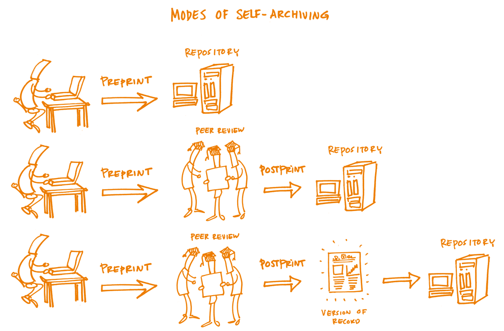

# Open Access to Published Research Results

## What is it?

Open Access to publications means that research publications like
articles and books can be accessed online, free of charge by any user,
with no technical obstacles (such as mandatory registration or login to
specific platforms). At the very least, such publications can be read
online, downloaded and printed. Ideally, additional rights such as the
right to copy, distribute, search, link, crawl and mine should also be
provided. Open Access can be realised through two main non-exclusive
routes:

  - > > > > 1.  Green Open Access (self-*archiving*): The published work
    > > > >     or the final peer-reviewed manuscript that has been
    > > > >     accepted for publication is made freely and openly
    > > > >     accessible by the author, or a representative, in an
    > > > >     online repository. Some publishers request that Open
    > > > >     Access be granted only after an embargo period has
    > > > >     elapsed. This embargo period can last anywhere between
    > > > >     several months and several years. For publications that
    > > > >     have been deposited in a repository but are under
    > > > >     embargo, usually at least the metadata are openly
    > > > >     accessible.

  - Gold Open Access (Open Access publishing): The published work is
    made available in Open Access mode by the publisher immediately upon
    publication. The most common business model is based on one-off
    payments by authors (commonly called APCs – article processing
    charges – or BPCs – book processing charges). Where Open Access
    content is combined with content that requires a subscription or
    purchase, in particular in the context of journals, conference
    proceedings and edited volumes, this is called hybrid Open Access.

<!-- end list -->

1.  # Rationale

One of the most common ways to disseminate research results is by
writing a manuscript and publishing it in a journal, conference
proceedings or book. For many years those publications were available to
the public under a payment by means of a subscription fee or
individually. However, at the turn of the 21st century a new movement
appeared with a clear objective: make all the research results available
to the public without any restriction. This movement took the name of
Open Access and established two initial strategies to achieve its final
goal. The first strategy was to provide tools and assistance to scholars
to deposit their refereed journal articles in open electronic
repositories. The second one was to launch a new generation of journals
using copyright and other tools to ensure permanent open access to all
the articles they publish. As a result of the first strategy we see
self-archiving practices: researchers depositing and disseminating
papers in institutional or subject based repositories. And as a result
of the second strategy we have seen the creation of the open access
journals that provide free access to readers and allow reuse of their
contents without almost any restriction.

Beyond those two strategies established in the [Budapest Open Access
Initiative](http://www.budapestopenaccessinitiative.org/read) in 2002,
we have seen the growth of new methods of dissemination. Among them, we
find the publication of preprints through institutional repositories and
preprint servers. Preprints are widely used in physical sciences and now
emerging in life sciences and other fields. Preprints are documents that
have not been peer reviewed but are considered as a complete scientific
publication in a first stage. Some of the preprints servers include open
peer review services and the availability to post new versions of the
initial paper once reviewed by peers. Following this trend of including
open peer review processes in preprint servers we have seen the
development of new publishing platforms supported by funders like the
[Wellcome Trust](https://wellcomeopenresearch.org/) or the [Bill and
Melinda Gates Foundation](https://gatesopenresearch.org/) . Even the
European Commission is planning to to launch a [publishing platform for
the Horizon 2020 funded
projects](https://ec.europa.eu/research/openscience/pdf/information_note_platform_public.pdf).

The choice of a journal or a publishing platform may affect the
availability and accessibility of the research results. There are
several options for researchers when deciding where, when, and how to
publish their findings. It is fundamental to know all the implications
to avoid future problems.

The rise of many business models around open access journals poses a lot
of misunderstandings and uncertainties to the researchers when deciding
where to publish. Moreover, paywalled journals offer individual open
access models, the so-called hybrid model, that brings more complexity
when deciding where and how to publish.

Regarding self archiving, researchers are confused by the different
requirements established by the publishers in relation with version of a
paper that they can deposit in a repository and when this version can be
available to the public. This delay in allowing public access to the
full text is often called embargo period and it is not uniform for all
the journals. Institutions who provide a repository for its researchers
should facilitate self archiving practices by digesting all those
publisher requirements.

# Learning objectives

1.  Learn about the different options a researcher has when deciding
    where to publish a paper, including funder requirements.

2.  Be able to decide if a paper can be published before peer review,
    for example in a preprint server. Trainees will learn how to
    determine which options they have according to their
    disciplines/journal policies, and if there would be consequences
    afterwards that might jeopardize final publication in a
    peer-reviewed journal.

3.  Trainees will learn how to discover the differences between policies
    of peer-reviewed journals, particularly when submitting something
    available as a preprint. They will learn the differences among
    open-access journals, such as which require a fee for
    submission/publication and which licenses they use.

4.  Trainees will learn about the implications of publishing in
    paywalled journals for future self-archiving in a repository, and
    the publisher requirements in terms of version and embargo. Trainees
    will also learn about hybrid open-access journals.

5.  (optional depending on audience) Trainees will learn about
    open-access opportunities when publishing in books, since this is
    the main avenue of dissemination for some disciplines.

6.  Trainees will learn about different business models used by
    open-access journals, and opportunities for obtaining funds to
    support publishing if needed.

# Key components

## Knowledge

### **Repositories and self-archiving**

At the beginning of 2018 more than 4600 repositories are available for
researchers to self-archive their publications according to the
[Registry of Open Access Repositories](http://roar.eprints.org/). In
this list we can find institutional repositories, subject based or
thematic repositories and harvesters. The first ones are generally
managed by research performing institutions to provide to their
community a place to archive and share openly papers and other research
outputs. Subject based repositories are usually managed by research
communities and most of the contents are related to a certain
discipline. Finally, harvesters aggregate content from different
repositories becoming sites to perform general searches and build other
value-added services. It is fundamental for a repository to be harvested
to acquire more visibility. For that purpose, repository managers need
to follow standard guidelines regarding the use of metadata and the
values of these metadata. Moreover, institutional repositories can be
linked with other information databases to increase discoverability, for
example [PubMed](https://www.ncbi.nlm.nih.gov/pubmed/) offers the
possibility to link its registers by the [linkout
project](https://www.ncbi.nlm.nih.gov/projects/linkout/doc/IR-application.shtml).
Repositories have always been seen as an alternative way to access to
scientific publications when accessing to the original source is not
affordable. Currently there are tools like the
[Unpaywall](http://unpaywall.org/) browser extension that facilitates
this alternative.

When choosing a journal to publish research results, researchers should
take a moment to read the journal policy regarding the transfer of
copyright. Many journals still require for publication that authors
transfer full copyright. This transfer of rights implies that authors
must ask for permission to reuse their own work beyond what is allowed
by the applicable law and unless there are some uses already granted.
Among those granted uses we can find teaching purposes, sharing with
colleagues, and especially how researchers can self-archive their papers
in repositories. Sometimes there a common policy among all the journals
published by the same publishers but in general journals have their own
policy, especially when they are published on behalf of a scientific
society. When looking at the self-archiving conditions we must identify
two key issues: the version of the paper that can be deposited and when
it can be publicly available.

Regarding the version, some journals allow the dissemination of the
submitted version, also known as preprint, and they allow its
replacement for a reviewed version once the final paper has been
published. Due to the increase of policies requiring access to research
results, most of the journals allow to deposit the accepted version of
the paper, also known as the author manuscript or postprint. This
version is the final text once the peer review process has ended but it
has not the final layout of the publication. Finally some journals allow
researchers to deposit the final published version, also known as the
version of record.

In relation to the moment to make the paper publicly available, many
journals establish a period of time from its original publication: the
embargo period, which can range from zero to 60 months. Some journals
include or exclude embargoes depending on the versions. For instance the
accepted version could be made publicly available after publication but
the published version must wait 12 months.

### **Open Access publishing**

The number of Open Access Journals has increased during the last years
becoming a real option for researchers when deciding where to publish
their findings. According to the Directory of Open Access Journals
([DOAJ](http://www.doaj.org/)), currently there are more than 11,000
journals. Nevertheless is important to remark that an open access
journal must provide free access to its contents but it also must
license them to allow reusability. No legal notice must be legally
understood as "all rights reserved". Although the definition of an open
access journal does not include any condition about the business model,
there is a fact that those journals are commonly known as journal where
you have to pay to publish. This misconception is due to the fact that
the most successful journals and the ones that got the highest impact
follow this model. Nevertheless, a recent study shows that the majority
of journals registered in DOAJ do not charge any fee for publication
(Data available
[here](https://sustainingknowledgecommons.org/2018/02/06/doaj-apc-information-as-of-jan-31-2018/)).

Currently many paywalled journals offer individual open access options
to researchers once the paper is accepted after peer review. Those
options include the publication under a free content license and free
accessibility to anyone since its first publication. This model is
commonly known as the hybrid model because in the same issue of a
journal, readers can find open access and paywalled contributions.
Usually publishers ask for a fee to open individual contributions.
Recent studies show that the hybrid fees are higher than the average of
the article processing charges in some pure open access journals ([Jahn
& Tullney 2016](https://doi.org/10/bnqm)). One of the reasons
researchers choose the hybrid model is to fulfil some of the
requirements of funders policy, especially the ones requiring immediate
public access to research results or short embargo periods.

Some funders, have decided to establish their own publishing platforms
to provide their grantees with a place to release their findings. In
general, to publish in those platforms costs around 1000 € and all the
materials are released under a CC BY license. The publication is not
limited to papers, researchers can include, for instance, data and
software. There is no previous peer review process and therefore
researchers publish documents that only pass through a limited editorial
review to check the format but there is not an evaluation on the
content. Peer review is done in a transparent way allowing anyone to see
who wrote it and what the comments were. After the open peer review,
authors can upload updated versions of their papers accordingly.

Some disciplines prefer to use other formats than journals to publish
results, for instance books. Initially, publishers were very reluctant
to allow researchers to self archive a full book or even a book chapter.
However, [some
publishers](https://docs.google.com/spreadsheets/d/1-Lq_zzaGqge8SdY1DX-YXTN43JLn75jf2OhidJqXM60/edit#gid=142126524)
have begun to adopt policies to facilitate it. On the other hand, some
university presses have shifted their publication model to open access
to increase the visibility of their contents, especially monographs.
This change can be explained as an answer to the cuts in some of the
expenditures in monographs due to the restrictions in library budgets. A
common model for this open access university presses is to provide a
free version in PDF and sell paper or epub versions (see for instance
UCL). Moreover the creation of the [Directory of Open Access
Books](https://doabooks.org/) have increased their discoverability. In a
similar way than other journal initiatives, there have appeared some
projects to join forces to establish a common fund to build open access
monographs, for instance [Knowledge
Unlatched](http://www.knowledgeunlatched.org/).

# Skills

  - Choose a suitable repository or server to post a preprint according
    to your discipline

  - Self archive a publication in a suitable repository, institutional
    or subject-based, following the possible restrictions posed by the
    publisher, mainly related to the allowed version to be deposit and
    the embargo period

  - Choose among the options of open-access journals and publishing
    platforms available

  - Find available funds or discounts to publish in open-access journals
    if needed

# Questions, obstacles, and common misconceptions

Q: "If I publish my work as a preprint, it won’t be acknowledged - I
will only receive credit for a peer-reviewed journal article."

A: Many funders are acknowledging the growing presence of preprint
publishing in their policies: Howard Hughes Medical Institute (HHMI),
Wellcome Trust, the Medical Research Council (UK) and the National
Institutes of Health (NIH) announced policies allowing researchers to
cite their own preprints in grant applications and reports
([Luther 2017](https://scholarlykitchen.sspnet.org/2017/04/18/stars-aligning-preprints/)).
In addition, preprints help establish priority of results and may
increase the impact - and citation count - of a later peer-reviewed
article ([McKiernan 2016](https://doi.org/10/gbqsng)).

There are still some researchers reluctant to deposit other versions
than the final published version. It is important to inform them about
the copyright implications when they sign a transfer document.

Avoid the misconception of understanding an open-access journal as a
journal where authors must pay to publish. The author-pay model is just
one of the existing business models for an open-access journal. You
might show data about the number of journals that do not ask for a
publication fee (for example, as of 31 January 2018, [DOAJ
reports](https://sustainingknowledgecommons.org/2018/02/06/doaj-apc-information-as-of-jan-31-2018/)
that 71% of the 11,001 open-access journals listed require no publishing
charge). You may want to show other business models like the [SCOAP3
Initiative](https://scoap3.org/), the [LingOA
project](http://www.lingoa.eu/), or the [Open Library of
Humanities](https://www.openlibhums.org/).

The use of publishing platforms has implications for research
evaluation, the peer-review process, and the role of publishers. There
are still many research assessments based on journal metrics and
therefore this new way of publishing challenges those evaluations.
Moreover the fact that peer review is completely transparent allows
readers to identify reviewers and track the versioning of the paper.
Finally, if those platforms become the common tool to publish results,
publishers would need to redefine their role in the scholarly
communication process.

The hybrid model is very controversial and it could raise a lot of
questions about the costs, possible double-dipping, and the use (or
lack) of licensing.

You may discuss the future of the scholarly communication by presenting
some of the offsetting models or transition projects like [OA2020 global
alliance](https://oa2020.org/) proposed by the Max Planck Society.

# Learning outcomes

1.  Trainees will be able to choose where to publish their research
    paper, describing the implications and consequences of this choice.

2.  Trainees will be able to determine the self-archiving policy of a
    journal where they want to publish based on the information
    available at the corresponding website or at any of the portals that
    provide general information as
    [Sherpa/Romeo](http://www.sherpa.ac.uk/romeo/),
    [Dulcinea](http://www.accesoabierto.net/dulcinea/), and
    [Heloïse](https://heloise.ccsd.cnrs.fr/).

3.  Trainees who want to establish a new open-access journal will be
    able to describe their own self-archiving policy, license, and
    business model.

4.  Trainees who manage repositories will be able to describe the tools
    and services that allow researchers to self-archive.

# Further reading

  - Björk (2017). Growth of hybrid open access, 2009–2016. *PeerJ*
    5:e3878
    [doi.org/10.7717/peerj.3878](https://doi.org/10.7717/peerj.3878)

  - Piwowar H, Priem J, Larivière V, Alperin JP, Matthias L, Norlander
    B, Farley A, West J, Haustein S. (2018) The state of OA: a
    large-scale analysis of the prevalence and impact of Open Access
    articles. *PeerJ* 6:e4375 <https://doi.org/10.7717/peerj.4375>

  - The Open Access Directory.
    [oad.simmons.edu/oadwiki](http://oad.simmons.edu/oadwiki/Main_Page)
